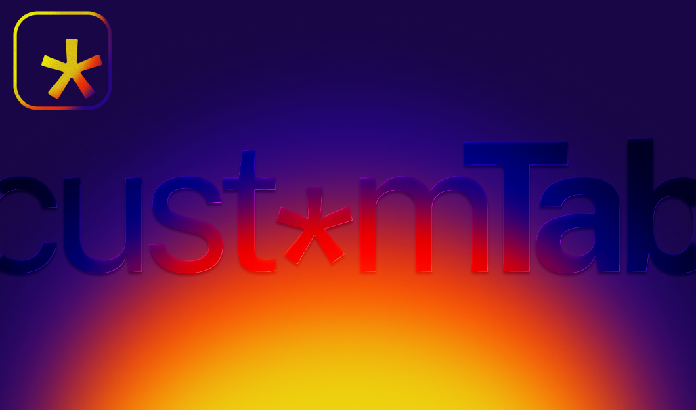

  

  
  <strong>cust*m Tab</strong> &mdash; <em>Your tab. Your rules.</em>

---

cust*m Tab replaces your new tab with either a **privacy-first dashboard** or
**your own URL** — your choice, configured in 30 seconds via an onboarding
wizard.

## Why cust*m Tab

 **Privacy by default.** DuckDuckGo and Brave are the top two default search options. No telemetry, no tracking, no accounts.

 **Two modes.** A gradient dashboard (clock, greeting, search, bookmarks) or a direct redirect to any URL — `https://`, `file://`, or `chrome-extension://`.

 **26 search engines.** 5 curated engines in the dashboard picker + 20 more in settings, each with a privacy badge.

 **Zero-friction setup.** A 4-step wizard runs on first install: mode → bookmarks → search → theme.

 **Persistence monitor.** An hourly check warns you if Chrome silently disables the new-tab override.

 **No frameworks.** Vanilla HTML/CSS/JS, well under 50 KB. Manifest V3.

## Privacy story

cust*m Tab does **not** collect, transmit, or sell any user data. All settings
and bookmarks stay in `chrome.storage.local` on your device. Search queries are
sent only to the engine you select, and only when you press Enter. The two
privacy-forward engines (DuckDuckGo, Brave) are surfaced first because they
profile the least.

## Screenshots

| Dashboard | Settings | Onboarding |
|-----------|----------|------------|
| *to be added* | *to be added* | *to be added* |

## Install (development)

1. Open Chrome → `chrome://extensions`
2. Enable **Developer mode** (top-right toggle)
3. Click **Load unpacked** → select the `extension/` folder
4. A new tab opens the onboarding wizard

## Documentation

- [README](extension/README.md) — quick start, file layout, cross-browser notes
- [Technical Documentation](extension/TECHNICAL.md) — architecture, storage schema, permissions

## License

MIT
