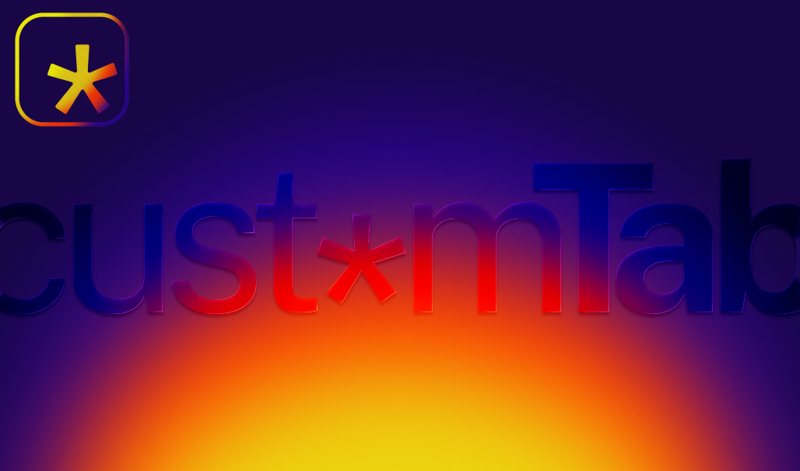

<p align="center">
  
</p>

<p align="center">
  
  <br>
  <strong>cust*m Tab</strong> &mdash; <em>Your tab. Your rules.</em>
</p>

<p align="center">
  <a href="https://github.com/philppplik/custm-tab/actions/workflows/ci.yml"></a>
  <a href="https://github.com/philppplik/custm-tab/actions/workflows/codeql.yml"></a>
  <a href="https://github.com/philppplik/custm-tab/releases/latest"></a>
  <a href="LICENSE"></a>
</p>

<p align="center">
  <a href="https://philppplik.github.io/custm-tab/"><strong>Website</strong></a> &middot;
  <a href="https://philppplik.github.io/custm-tab/privacy.html">Privacy</a> &middot;
  <a href="extension/TECHNICAL.md">Technical docs</a> &middot;
  <a href="CONTRIBUTING.md">Contributing</a>
</p>

---

cust*m Tab replaces the new tab page with either a **dashboard you configure** or
**a URL of your own**. It has no account, no telemetry, and no server behind it.

Runs in **Chrome 121+** and **Firefox 142+** from one source tree. Vanilla HTML,
CSS and JavaScript, no runtime dependencies, and no build step needed to run it.

## What it does

**Bookmarks you edit in place.** Add, rename, delete and drag to reorder tiles
directly on the tab. Changes persist immediately.

**26 search engines, privacy-forward first.** DuckDuckGo and Brave lead the
list. Each engine carries an honest badge saying whether that provider builds a
profile of you. Type `ct` in the address bar to search without opening a tab;
`ct brave cats` forces a specific engine for one query.

**Backgrounds you choose.** Six gradient palettes, any solid colour via a
picker, a photo from Pexels, or your own picture from disk. Pick a flat colour
and the interface derives its own text contrast from that colour's WCAG
luminance, so a pale background gets dark text rather than being disallowed.

**An interface you shape.** Glass, frosted or solid material. A clock you can
resize, reweight, restyle or switch off. A greeting that says the time of day
with your name, your own headline instead, or nothing. Turn all of it off and
the tab is a search bar over a background — which is a legitimate answer, so it
is one you can pick.

**Photo backgrounds on your own key.** Set a search term and get a new photo
every day, every hour, or on every tab. The photographer is always credited.
See [docs/PEXELS.md](docs/PEXELS.md).

**A sunrise reveal.** The background rises and blooms as the tab opens, animated
on the compositor so it never delays first paint. Skipped automatically under
`prefers-reduced-motion`.

**Or skip the dashboard.** Point the new tab at any URL, including a local file
or another extension page.

**Opt-in sync.** Mirror preferences across devices if you want to. Bookmarks and
your API key never leave the device.

## Privacy

The extension collects nothing. Four things can leave your browser, each only
because you asked:

| When                                 | What is sent                          | To                      |
| ------------------------------------ | ------------------------------------- | ----------------------- |
| You press Enter in the search bar    | Your query                            | The engine you selected |
| You enable photo backgrounds         | Your search term and your own API key | `api.pexels.com`        |
| You switch the icon source to remote | Each bookmark's hostname              | `icons.duckduckgo.com`  |
| You switch the icon source to sites  | A request for `/favicon.ico`          | Each bookmarked site    |

By default, bookmark icons resolve from the browser's own on-device cache, with
locally drawn letter tiles as the fallback.

> Versions before 1.2.0 requested every bookmark icon from Google on every new
> tab, which contradicted the privacy promise in this README. That is fixed; see
> the [changelog](CHANGELOG.md).

Full policy: <https://philppplik.github.io/custm-tab/privacy.html>

## Install

Store listings are pending. Until then, take the packages from the
[latest release](https://github.com/philppplik/custm-tab/releases/latest):

**Chrome, Edge, Brave** - unzip `custm-tab-chrome-*.zip`, open
`chrome://extensions`, enable Developer mode, choose _Load unpacked_, select the
folder.

**Firefox** - unzip `custm-tab-firefox-*.zip`, open
`about:debugging#/runtime/this-firefox`, choose _Load Temporary Add-on_, select
`manifest.json`.

A four-step wizard opens on first run.

## Develop

```bash
git clone https://github.com/philppplik/custm-tab.git
cd custm-tab
npm install
npm run verify
```

| Command                  | What it does                                                 |
| ------------------------ | ------------------------------------------------------------ |
| `npm run verify`         | Everything CI runs: format, lint, manifest validation, tests |
| `npm test`               | Unit and integration tests                                   |
| `npm run test:coverage`  | Tests plus coverage thresholds                               |
| `npm run build`          | Per-browser packages into `dist/`                            |
| `npm run lint:ext`       | `web-ext lint` against the Firefox package                   |
| `npm run screenshots`    | Serve the preview harness to regenerate store assets         |
| `npm run generate:icons` | Re-vendor the search engine brand glyphs (needs network)     |

`extension/` loads unpacked in both browsers as-is. The Node tooling lints,
tests and packages; it never compiles the source.

See [CONTRIBUTING.md](CONTRIBUTING.md) for the full workflow and
[extension/TECHNICAL.md](extension/TECHNICAL.md) for the architecture.

## Repository layout

```
extension/     the add-on itself (this is what ships)
docs/          GitHub Pages site, privacy policy, Pexels and store guides
screenshots/   store assets, generated from the real UI
scripts/       manifest validator and per-browser packaging
tests/         Vitest suites with an in-memory chrome.* mock
tools/preview/ harness that renders the real UI for screenshots
```

## Security

Report vulnerabilities privately through
[GitHub Security Advisories](https://github.com/philppplik/custm-tab/security/advisories/new),
not a public issue. See [SECURITY.md](SECURITY.md).

CodeQL, Dependabot, dependency review, and secret scanning with push protection
all run on this repository.

## License

MIT. See [LICENSE](LICENSE).
